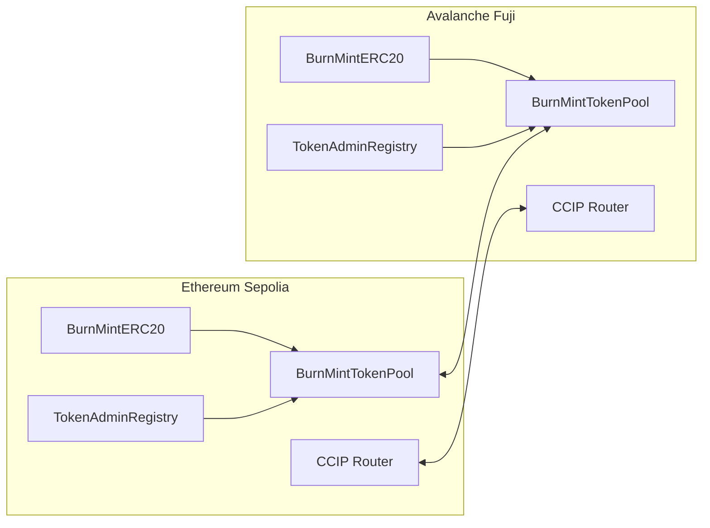

# SecureVal

SecureVal is a Foundry project for securing and transferring tokenized value
across chains with an explicit burn-and-mint model between Ethereum Sepolia and
Avalanche Fuji.

The project is powered by Chainlink CCIP and the Cross-Chain Token (CCT)
standard. It uses pinned `BurnMintERC20` token and `BurnMintTokenPool`
contracts directly from Git submodules and walks through the complete lifecycle:

1. Deploy a burn-and-mint ERC20 on each chain.
2. Deploy a burn-and-mint token pool on each chain.
3. Claim and accept token admin rights in the CCIP token admin registry.
4. Set each token's pool.
5. Configure each pool to trust the remote chain, token, and pool.
6. Mint test tokens.
7. Transfer tokens cross-chain with CCIP and track the message in CCIP Explorer.

## Why This Project Exists

SecureVal exists to make cross-chain value transfer concrete and repeatable.
Chainlink CCIP provides the cross-chain messaging and token-transfer
infrastructure, and a Cross-Chain Token (CCT) is configured to move through
CCIP using a token pool on each supported chain.

This repo is intentionally narrow and practical: it is a testnet-ready
SecureVal workflow for a burn-and-mint CCT between Ethereum Sepolia and
Avalanche Fuji. The scripts are split into small deployment and admin steps so
each transaction is explicit, auditable, and easy to retry.

## Architecture



In the burn-and-mint model:

- Tokens are burned by the source-chain pool.
- CCIP delivers the token-transfer message.
- Tokens are minted by the destination-chain pool.
- Each pool must trust the remote pool and remote token before transfers work.

## What Is Included

- `script/DeployToken.s.sol`: deploys the pinned `BurnMintERC20`.
- `script/DeployPool.s.sol`: deploys the pinned `BurnMintTokenPool` and grants it mint/burn roles.
- `script/ClaimAdmin.s.sol`: registers the token admin through `RegistryModuleOwnerCustom`.
- `script/AcceptAdmin.s.sol`: accepts the pending token admin role.
- `script/SetPool.s.sol`: sets the token pool in the token admin registry.
- `script/ConfigurePool.s.sol`: configures remote token/pool trust and optional rate limits.
- `script/Mint.s.sol`: mints test tokens.
- `script/TransferTokens.s.sol`: sends a CCIP token transfer and logs the message ID plus CCIP Explorer URL.
- `script/NetworkConfig.sol`: Sepolia and Fuji CCIP addresses and chain selectors.
- `.env.example`: every deployment-time variable with comments.

## Safety Model

This project is for testnets only.

The scripts can deploy contracts and send CCIP messages when run with
`--broadcast`. Review every command before running it. You need a funded wallet
on the source chain for gas, and you need fee funding in either native gas token
or LINK depending on `FEE_TOKEN`.

`PRIVATE_KEY` in `.env` must include the `0x` prefix:

```bash
PRIVATE_KEY=0xYOUR_PRIVATE_KEY
```

## Prerequisites

- Foundry installed: `forge`, `cast`, and `anvil`
- Git
- A funded testnet wallet for Ethereum Sepolia and Avalanche Fuji
- Ethereum Sepolia RPC URL
- Avalanche Fuji RPC URL
- Testnet native gas on each source chain
- Optional: testnet LINK if you set `FEE_TOKEN` to LINK instead of native fees

Install Foundry:

```bash
curl -L https://foundry.paradigm.xyz | bash
foundryup
```

Or, on macOS with Homebrew:

```bash
brew install foundry
```

## Dependency Pinning

This repo uses Git submodules pinned to exact commits. Do not use
`forge install`, because that can drift to newer contract versions.

Clone with submodules:

```bash
git clone --recurse-submodules https://github.com/disbitski/secureval.git
cd secureval
```

Or initialize after cloning:

```bash
git submodule update --init --recursive
```

Pinned dependencies:

| Dependency | Tag or release | Commit |
| --- | --- | --- |
| `smartcontractkit/chainlink-ccip` | `contracts-ccip-v1.6.4` | `bccdd15b734ea6c0e6d1b3d36c482e64ced2d441` |
| `smartcontractkit/chainlink-evm` | `contracts-v1.5.0` | `86aa5a1d34b20eda8d18fe6eb0e4882948e545ba` |
| `foundry-rs/forge-std` | `v1.16.1` | `620536fa5277db4e3fd46772d5cbc1ea0696fb43` |
| `OpenZeppelin/openzeppelin-contracts` | `v5.0.2` | `dbb6104ce834628e473d2173bbc9d47f81a9eec3` |
| `OpenZeppelin/openzeppelin-contracts` | `v4.8.3` | `0a25c1940ca220686588c4af3ec526f725fe2582` |

## Compiler Settings

The optimizer is enabled in `foundry.toml`:

```toml
optimizer = true
optimizer_runs = 80000
via_ir = true
```

The CCIP pool contracts can exceed the 24KB contract size limit without the
optimizer.

## CCIP Testnet Constants

These constants are wired into `script/NetworkConfig.sol`.

| Network | Chain selector | Router | Token admin registry | Registry module owner |
| --- | --- | --- | --- | --- |
| Ethereum Sepolia | `16015286601757825753` | `0x0BF3dE8c5D3e8A2B34D2BEeB17ABfCeBaf363A59` | `0x95F29FEE11c5C55d26cCcf1DB6772DE953B37B82` | `0xa3c796d480638d7476792230da1E2ADa86e031b0` |
| Avalanche Fuji | `14767482510784806043` | `0xF694E193200268f9a4868e4Aa017A0118C9a8177` | `0xA92053a4a3922084d992fD2835bdBa4caC6877e6` | `0xefa93f3312840683893DbdeB3d53359b2d948F50` |

Official references:

- Chainlink CCIP docs: https://docs.chain.link/ccip
- CCIP testnet directory: https://docs.chain.link/ccip/directory/testnet
- CCT overview: https://docs.chain.link/ccip/concepts/cross-chain-token/overview
- CCT registration and administration: https://docs.chain.link/ccip/concepts/cross-chain-token/evm/registration-administration
- CCIP Explorer: https://ccip.chain.link/

## Setup

Create your local environment file:

```bash
cp .env.example .env
```

Fill these first:

```bash
PRIVATE_KEY=0xYOUR_PRIVATE_KEY
ETHEREUM_SEPOLIA_RPC_URL=https://your-sepolia-rpc
AVALANCHE_FUJI_RPC_URL=https://your-fuji-rpc
TOKEN_NAME="SecureVal Token"
TOKEN_SYMBOL=SVAL
TOKEN_DECIMALS=18
TOKEN_MAX_SUPPLY=0
TOKEN_PREMINT=0
```

Load env vars:

```bash
set -a
source .env
set +a
```

Build:

```bash
forge build
```

Expected result:

```text
Compiler run successful!
```

## Deployment Flow

Run each step on both chains. Record the token and pool addresses as they are
printed.

### 1. Deploy Token

Ethereum Sepolia:

```bash
forge script script/DeployToken.s.sol:DeployToken \
  --rpc-url "$ETHEREUM_SEPOLIA_RPC_URL" \
  --broadcast
```

Set the deployed token address:

```bash
export ETHEREUM_SEPOLIA_TOKEN_ADDRESS=<sepolia token address>
```

Avalanche Fuji:

```bash
forge script script/DeployToken.s.sol:DeployToken \
  --rpc-url "$AVALANCHE_FUJI_RPC_URL" \
  --broadcast
```

Set the deployed token address:

```bash
export AVALANCHE_FUJI_TOKEN_ADDRESS=<fuji token address>
```

### 2. Deploy Pool

Ethereum Sepolia:

```bash
TOKEN_ADDRESS="$ETHEREUM_SEPOLIA_TOKEN_ADDRESS" \
forge script script/DeployPool.s.sol:DeployPool \
  --rpc-url "$ETHEREUM_SEPOLIA_RPC_URL" \
  --broadcast
```

Set the deployed pool address:

```bash
export ETHEREUM_SEPOLIA_POOL_ADDRESS=<sepolia pool address>
```

Avalanche Fuji:

```bash
TOKEN_ADDRESS="$AVALANCHE_FUJI_TOKEN_ADDRESS" \
forge script script/DeployPool.s.sol:DeployPool \
  --rpc-url "$AVALANCHE_FUJI_RPC_URL" \
  --broadcast
```

Set the deployed pool address:

```bash
export AVALANCHE_FUJI_POOL_ADDRESS=<fuji pool address>
```

`DeployPool` grants the deployed pool mint and burn roles on the local token.

### 3. Claim Admin

This registers your token admin through `RegistryModuleOwnerCustom`. The
Chainlink `BurnMintERC20` exposes `getCCIPAdmin()`, and the deployer is the
initial CCIP admin.

Ethereum Sepolia:

```bash
TOKEN_ADDRESS="$ETHEREUM_SEPOLIA_TOKEN_ADDRESS" \
forge script script/ClaimAdmin.s.sol:ClaimAdmin \
  --rpc-url "$ETHEREUM_SEPOLIA_RPC_URL" \
  --broadcast
```

Avalanche Fuji:

```bash
TOKEN_ADDRESS="$AVALANCHE_FUJI_TOKEN_ADDRESS" \
forge script script/ClaimAdmin.s.sol:ClaimAdmin \
  --rpc-url "$AVALANCHE_FUJI_RPC_URL" \
  --broadcast
```

### 4. Accept Admin

The pending token admin must accept the role.

Ethereum Sepolia:

```bash
TOKEN_ADDRESS="$ETHEREUM_SEPOLIA_TOKEN_ADDRESS" \
forge script script/AcceptAdmin.s.sol:AcceptAdmin \
  --rpc-url "$ETHEREUM_SEPOLIA_RPC_URL" \
  --broadcast
```

Avalanche Fuji:

```bash
TOKEN_ADDRESS="$AVALANCHE_FUJI_TOKEN_ADDRESS" \
forge script script/AcceptAdmin.s.sol:AcceptAdmin \
  --rpc-url "$AVALANCHE_FUJI_RPC_URL" \
  --broadcast
```

### 5. Set Pool

This links each token to its local pool in the CCIP token admin registry.

Ethereum Sepolia:

```bash
TOKEN_ADDRESS="$ETHEREUM_SEPOLIA_TOKEN_ADDRESS" \
POOL_ADDRESS="$ETHEREUM_SEPOLIA_POOL_ADDRESS" \
forge script script/SetPool.s.sol:SetPool \
  --rpc-url "$ETHEREUM_SEPOLIA_RPC_URL" \
  --broadcast
```

Avalanche Fuji:

```bash
TOKEN_ADDRESS="$AVALANCHE_FUJI_TOKEN_ADDRESS" \
POOL_ADDRESS="$AVALANCHE_FUJI_POOL_ADDRESS" \
forge script script/SetPool.s.sol:SetPool \
  --rpc-url "$AVALANCHE_FUJI_RPC_URL" \
  --broadcast
```

### 6. Configure Pool

This configures each pool to trust the remote chain, remote token, and remote
pool.

Configure Sepolia to trust Fuji:

```bash
LOCAL_POOL_ADDRESS="$ETHEREUM_SEPOLIA_POOL_ADDRESS" \
REMOTE_POOL_ADDRESS="$AVALANCHE_FUJI_POOL_ADDRESS" \
REMOTE_TOKEN_ADDRESS="$AVALANCHE_FUJI_TOKEN_ADDRESS" \
REMOTE_CHAIN_SELECTOR=14767482510784806043 \
forge script script/ConfigurePool.s.sol:ConfigurePool \
  --rpc-url "$ETHEREUM_SEPOLIA_RPC_URL" \
  --broadcast
```

Configure Fuji to trust Sepolia:

```bash
LOCAL_POOL_ADDRESS="$AVALANCHE_FUJI_POOL_ADDRESS" \
REMOTE_POOL_ADDRESS="$ETHEREUM_SEPOLIA_POOL_ADDRESS" \
REMOTE_TOKEN_ADDRESS="$ETHEREUM_SEPOLIA_TOKEN_ADDRESS" \
REMOTE_CHAIN_SELECTOR=16015286601757825753 \
forge script script/ConfigurePool.s.sol:ConfigurePool \
  --rpc-url "$AVALANCHE_FUJI_RPC_URL" \
  --broadcast
```

By default, rate limiters are disabled. To enable them, set these before
running `ConfigurePool`:

```bash
export OUTBOUND_RATE_LIMIT_ENABLED=true
export OUTBOUND_RATE_LIMIT_CAPACITY=1000000000000000000000
export OUTBOUND_RATE_LIMIT_RATE=1000000000000000000
export INBOUND_RATE_LIMIT_ENABLED=true
export INBOUND_RATE_LIMIT_CAPACITY=1100000000000000000000
export INBOUND_RATE_LIMIT_RATE=1000000000000000000
```

Capacity and rate use the token's smallest unit. For an 18-decimal token,
`1000000000000000000` is 1 token.

### 7. Mint

Mint tokens to the sender or another receiver on the source chain.

Ethereum Sepolia:

```bash
TOKEN_ADDRESS="$ETHEREUM_SEPOLIA_TOKEN_ADDRESS" \
RECEIVER="$RECEIVER" \
AMOUNT="$AMOUNT" \
forge script script/Mint.s.sol:Mint \
  --rpc-url "$ETHEREUM_SEPOLIA_RPC_URL" \
  --broadcast
```

Avalanche Fuji:

```bash
TOKEN_ADDRESS="$AVALANCHE_FUJI_TOKEN_ADDRESS" \
RECEIVER="$RECEIVER" \
AMOUNT="$AMOUNT" \
forge script script/Mint.s.sol:Mint \
  --rpc-url "$AVALANCHE_FUJI_RPC_URL" \
  --broadcast
```

### 8. Transfer

Transfer from Ethereum Sepolia to Avalanche Fuji:

```bash
TOKEN_ADDRESS="$ETHEREUM_SEPOLIA_TOKEN_ADDRESS" \
RECEIVER="$RECEIVER" \
AMOUNT="$AMOUNT" \
DESTINATION_CHAIN_SELECTOR=14767482510784806043 \
forge script script/TransferTokens.s.sol:TransferTokens \
  --rpc-url "$ETHEREUM_SEPOLIA_RPC_URL" \
  --broadcast
```

Transfer from Avalanche Fuji to Ethereum Sepolia:

```bash
TOKEN_ADDRESS="$AVALANCHE_FUJI_TOKEN_ADDRESS" \
RECEIVER="$RECEIVER" \
AMOUNT="$AMOUNT" \
DESTINATION_CHAIN_SELECTOR=16015286601757825753 \
forge script script/TransferTokens.s.sol:TransferTokens \
  --rpc-url "$AVALANCHE_FUJI_RPC_URL" \
  --broadcast
```

The transfer script logs:

- the quoted CCIP fee
- the CCIP message ID
- a CCIP Explorer link in this format:

```text
https://ccip.chain.link/msg/<messageId>
```

## Native Fees vs LINK Fees

By default, `.env.example` uses native gas for CCIP fees:

```bash
FEE_TOKEN=0x0000000000000000000000000000000000000000
```

To pay fees in LINK, set `FEE_TOKEN` to the LINK token address for the active
source chain and make sure the sender has enough LINK.

The configured testnet LINK addresses are in `script/NetworkConfig.sol`.

## Verifying Setup

Build everything:

```bash
forge build
```

Inspect configured submodule pins:

```bash
git submodule status
```

Check a pool after configuration:

```bash
cast call "$ETHEREUM_SEPOLIA_POOL_ADDRESS" \
  "isSupportedChain(uint64)(bool)" \
  14767482510784806043 \
  --rpc-url "$ETHEREUM_SEPOLIA_RPC_URL"
```

Check the token's registered pool:

```bash
cast call 0x95F29FEE11c5C55d26cCcf1DB6772DE953B37B82 \
  "getPool(address)(address)" \
  "$ETHEREUM_SEPOLIA_TOKEN_ADDRESS" \
  --rpc-url "$ETHEREUM_SEPOLIA_RPC_URL"
```

For Fuji, use the Fuji token admin registry:

```bash
cast call 0xA92053a4a3922084d992fD2835bdBa4caC6877e6 \
  "getPool(address)(address)" \
  "$AVALANCHE_FUJI_TOKEN_ADDRESS" \
  --rpc-url "$AVALANCHE_FUJI_RPC_URL"
```

## Troubleshooting

### `forge build` fails on contract size

Make sure `foundry.toml` has optimizer settings enabled:

```toml
optimizer = true
optimizer_runs = 80000
via_ir = true
```

### Claim admin reverts

Confirm the wallet running the script matches `getCCIPAdmin()` on the token.
The deployer is the initial CCIP admin for the pinned `BurnMintERC20`.

### Accept admin reverts

Run `ClaimAdmin` first, then run `AcceptAdmin` with the same pending admin
wallet.

### Set pool reverts

Confirm the wallet has accepted token admin rights in the token admin registry.

### Configure pool reverts

Common causes:

- `REMOTE_POOL_ADDRESS` or `REMOTE_TOKEN_ADDRESS` is missing.
- You accidentally configured Sepolia with Sepolia addresses instead of Fuji addresses.
- The rate limiter is disabled but capacity/rate are nonzero.
- The rate limiter rate is greater than capacity.

### Transfer reverts

Common causes:

- Pools are not configured on both chains.
- The sender has no token balance.
- The sender lacks native gas or LINK for CCIP fees.
- The router does not have token approval.
- `RECEIVER` is not set to the destination-chain recipient.

## Repository Layout

```text
.
|-- foundry.toml
|-- remappings.txt
|-- .env.example
|-- script/
|   |-- DeployToken.s.sol
|   |-- DeployPool.s.sol
|   |-- ClaimAdmin.s.sol
|   |-- AcceptAdmin.s.sol
|   |-- SetPool.s.sol
|   |-- ConfigurePool.s.sol
|   |-- Mint.s.sol
|   |-- TransferTokens.s.sol
|   `-- NetworkConfig.sol
|-- src/
|   `-- README.md
`-- lib/
    |-- chainlink-ccip
    |-- chainlink-evm
    |-- forge-std
    |-- openzeppelin-contracts
    `-- openzeppelin-contracts-4.8.3
```

## Notes for Maintainers

- Keep dependencies pinned to exact commits.
- Prefer `git submodule update --init --recursive` over `forge install`.
- Keep CCT admin actions split into separate scripts.
- Treat rate-limit changes as an explicit admin action.
- Do not broadcast scripts against mainnet from this template without a separate review.

## License

This project's scripts and documentation are provided under the MIT license.
Submodule dependencies retain their original licenses.
